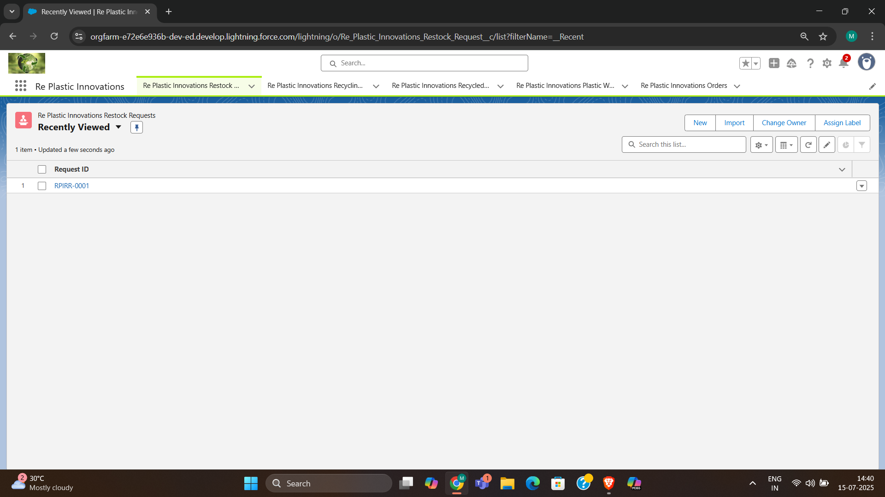
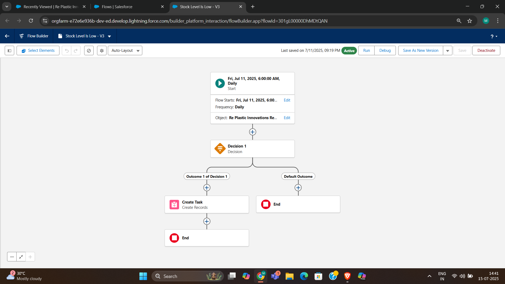
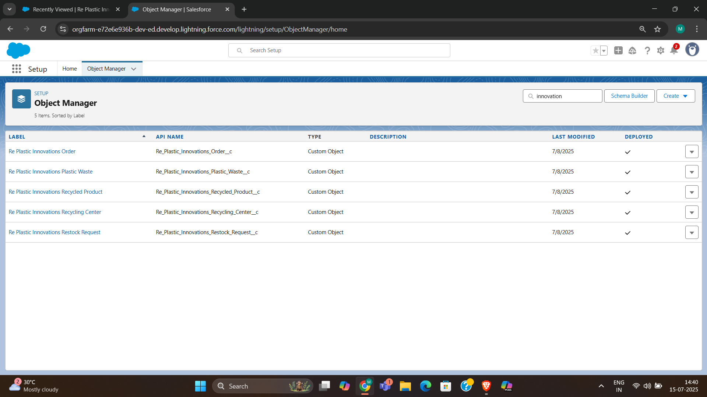
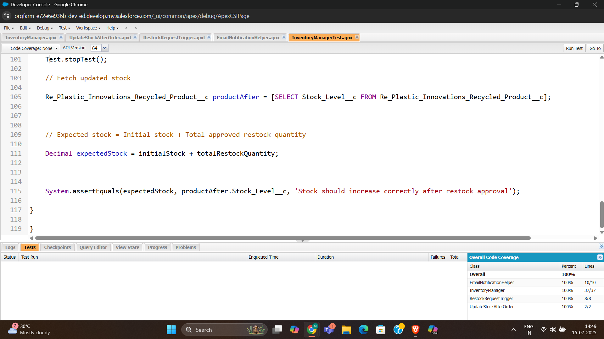

# RePlastix Innovations – Salesforce Capstone Project

This is a Salesforce-based recycling and inventory management system built as part of my capstone project. It helps automate plastic waste tracking, product inventory, order processing, and restocking using flows, Apex, and triggers.

---

## Features

- **Plastic Waste Tracking**  
  Custom object to track waste type, weight, collection location, and recycling center.

- **Inventory Automation**  
  Automatically monitors stock levels of recycled products and creates restock tasks if stock falls below threshold.

- **Order Management**  
  Automatically reduces stock when orders are placed.

- **Restock Workflow**  
  Automatically updates stock and notifies warehouse manager when restock is approved.

- **Email Notification**  
  Sends email to warehouse manager when stock is restocked.

- **100% Apex Test Coverage**  
  Includes complete test classes for all logic.

---

## Objects Created

| Object | Purpose |
|--------|---------|
| Re_Plastic_Innovations_Plastic_Waste__c | Track plastic waste collected |
| Re_Plastic_Innovations_Recycled_Product__c | Manage inventory of recycled products |
| Re_Plastic_Innovations_Order__c | Handle product orders |
| Re_Plastic_Innovations_Restock_Request__c | Raise and approve restock requests |
| Re_Plastic_Innovations_Recycling_Center__c | Stores info about recycling centers |

---

## Automations

### Flow: Stock Level Check  
- Runs **daily at 6 AM**  
- Checks if `Stock_Level__c < Threshold__c`  
- Creates a Task to notify product owner

### Trigger: Order → Stock Update  
- Reduces stock on order placement  
- Creates restock request if stock is low

### Trigger: Restock Approval → Stock Refill  
- Increases stock if restock request is approved  
- Sends email to warehouse manager

---

## Apex Classes

- `InventoryManager.cls` – Core business logic
- `EmailNotificationHelper.cls` – Sends email on restock approval
- `InventoryManagerTest.cls` – Test class with full coverage

> ✅ All Apex logic covered with unit tests and assert checks.

---

## Email Notification

When a restock request is approved, the system:
- Updates the product stock
- Sends an email notification:
  - Subject: “Restock Request Approved”
  - Message: “Stock is now updated — please proceed to refill.”

## 📸 Screenshots

| View              | Screenshot                                 |
|-------------------|--------------------------------------------|
| App Homepage      |               |
| Flow Diagram      |                  |
| Object Manager    |          |
| Test Class Result |        |

## Demo Video

▶️ [Click here to watch the project walkthrough](https://drive.google.com/drive/folders/1xJ2CB60_OLxKVRr1h-_zfgUA_sYilu99)

---

## About Me

👋 I’m **Mohd Husamuddin**, a Salesforce Developer trainee.  
This capstone helped me explore real-time automation, Apex development, and user-level data control in Salesforce.

---

## 🏁 Final Note

Thank you for reviewing my project!  
If you’d like to collaborate or provide feedback, feel free to reach out.

